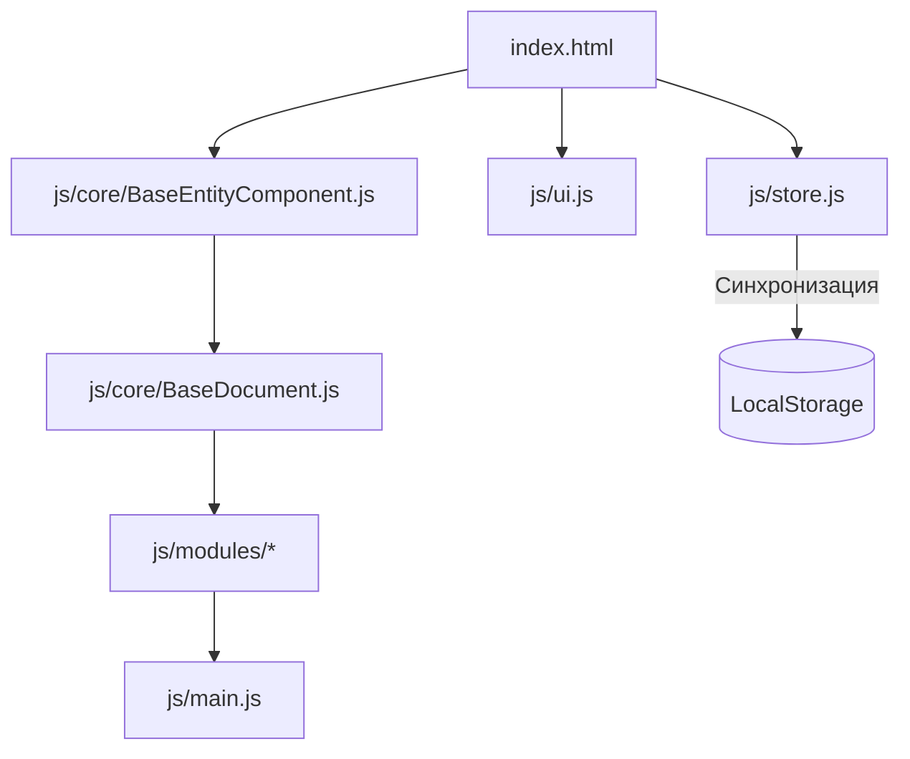

# Техническая документация проекта SOCKS.PRO (LuckySocks)

Данный документ содержит подробное описание технической архитектуры, структуры данных, логики работы базовых классов, механизмов валидации и адаптивной верстки чулочно-носочной ERP/MES-системы **SOCKS.PRO**.

---

## 🏗️ 1. Архитектурный паттерн и Жизненный цикл

Система построена по принципу **модульного Single Page Application (SPA)** без использования тяжелых внешних фреймворков. Весь интерфейс рендерится динамически с помощью JavaScript, что обеспечивает мгновенный отклик и отсутствие перезагрузок.

### Схема взаимодействия компонентов:



### Жизненный цикл загрузки:
1. **Инициализация БД**: `js/store.js` загружает данные из `LocalStorage`. Если данных нет, подгружаются демонстрационные массивы (заказы, справочники, сотрудники).
2. **Инициализация интерфейса**: `js/ui.js` строит базовую структуру, регистрирует обработчики событий для меню (включая динамическое клонирование десктопного меню в мобильную шторку-drawer).
3. **Отрисовка вкладок**: При клике на раздел в меню срабатывает функция `switchViewport(tabId)` в `js/main.js`, которая:
   - Обновляет заголовки страницы (`page-title`, `page-subtitle`).
   - Инициализирует соответствующий класс из `docMap` или вызывает функцию рендеринга (например, `renderReports`).
   - Передает управление рендереру контента.

---

## 💾 2. Состояние и СУБД (State Management)

Все данные приложения хранятся в глобальном реактивном объекте `state`, объявленном в `js/store.js`. Синхронизация с постоянным хранилищем выполняется автоматически при каждом изменении через функцию `saveState()`.

### Структура базы данных (`state`):

| Ключ в `state` | Тип данных | Описание |
| :--- | :--- | :--- |
| `nomenclature` | Array (Object) | Номенклатурные позиции готовой продукции (ГП). |
| `lines` | Array (Object) | Производственные линии цехов. |
| `currencies` | Array (Object) | Справочник валют и история курсов НБКР. |
| `counterparties`| Array (Object) | Клиенты, поставщики и договоры. |
| `employees` | Array (Object) | База сотрудников (операторы вязания, швеи, упаковщики). |
| `orders` | Array (Object) | Заказы клиентов (сводные данные и мультивалютные спецификации). |
| `specifications`| Array (Object) | Спецификации изделий (нормы расхода сырья, время цикла). |
| `planning` | Array (Object) | Запуски в производство (очередь и привязка к линиям). |
| `releases` | Array (Object) | Документы выработки Вязального цеха (полуфабрикаты). |
| `sewings` | Array (Object) | Документы выработки Швейного цеха (сборка мыска). |
| `packagings` | Array (Object) | Документы Упаковочного цеха (сдача готовой продукции по сортам). |
| `realizations` | Array (Object) | Документы отгрузки ГП покупателям со склада. |
| `pmp` | Array (Object) | Производственно-мощностные планы по месяцам. |

---

## ⚙️ 3. Базовые классы ядра

Для стандартизации разработки и избежания дублирования кода в системе реализованы два абстрактных класса.

### 3.1. `BaseEntityComponent` (Справочники и плоские таблицы)
Класс инкапсулирует CRUD-операции над плоскими справочниками:
* **Постраничная пагинация (`Pagination`)**: По умолчанию использует выбор размера страницы (5, 10, 20, 50, 100 строк), сохраняемый в настройках пользователя.
* **Поиск и фильтрация**: Полнотекстовый поиск по всем строковым полям, а также фильтрация по конкретным колонкам.
* **Экспорт**: Выгрузка текущей отфильтрованной таблицы в формат CSV.
* **Адаптивный рендеринг**: Метод `isMobile()` определяет ширину экрана и автоматически перестраивает таблицу в карточки `.mobile-card`.

### 3.2. `BaseDocument` (Ядро документов)
Наследуется от `BaseEntityComponent` и добавляет механизмы документооборота:
* **Статусы документа**: Поддержка жизненного цикла (Черновик ➔ Проведен ➔ Удален).
* **Модальные формы редактирования**: Отрисовка динамических форм ввода спецификаций с поддержкой добавления и удаления строк.
* **Валидация (`reportValidity()`)**: Контроль обязательности заполнения полей с использованием встроенных браузерных средств и кастомных JS-обработчиков.

---

## 🔒 4. Алгоритмы жесткого контроля остатков

Особое внимание в коде уделено контролю остатков сырья и полуфабрикатов на межоперационных переходах.

### 4.1. Схема движения остатков по стадиям производства:

```
[Заказ покупателя]
       │ (кол-во пар)
       ▼
[Планирование и запуск] ───► Блокировка планирования сверх заказа
       │ (кол-во пар)
       ▼
[Вязальный цех] ──────────► Блокировка выпуска полуфабриката (ПФ) сверх плана (в шт. = пары * 2)
       │ (кол-во штук)
       ▼
[Швейный цех] ────────────► Блокировка прошива готовой продукции (ГП) сверх связанного (пар = шт / 2)
       │ (кол-во пар ГП)
       ▼
[Упаковка цеха] ──────────► Блокировка упаковки на склад ГП сверх прошитого объема (по сортам)
       │ (кол-во пар ГП)
       ▼
[Реализация] ─────────────► Блокировка отгрузки покупателю сверх складского остатка (Упаковано - Отгружено)
```

### 4.2. Метод расчета остатка к обработке в формах спецификаций:
В модулях `releases`, `sewings`, `packagings` и `realizations` при заполнении строк спецификации вызывается расчет доступных лимитов. 
Например, для упаковочного цеха:
```javascript
// Доступно к упаковке = Прошито швеями - Уже упаковано другими документами
const sewnQty = window.getSewnQtyForPlan(planNum);
const packagedQty = window.getPackagedQtyForPlan(planNum, currentDocId);
const available = Math.max(0, sewnQty - packagedQty);
```
Если пользователь пытается провести объем, превышающий `available`, транзакция прерывается вызовом `alert()` и документ остается в статусе черновика.

---

## 📐 5. Логика и формулы Мощностного планирования (ПМП)

Документ ПМП распределен по трем этапам производства (**Вязальный**, **Прошив**, **Упаковка**).

### 5.1. Расчеты спецификаций (на лету в карточке документа):
При изменении количества оборудования ($N$), рабочих дней ($D$), часов работы в сутки ($H$), коэффициента выработки в % ($E$) или времени цикла в секундах ($C$):
1. **Плановый объем времени работы оборудования (в секундах)**:
   $$\text{PlannedSec} = N \times D \times H \times 3600 \times \frac{E}{100}$$
2. **Плановый выпуск (в штуках для Вязального, в парах для остальных)**:
   $$\text{PlannedQty} = \text{round}\left( \frac{\text{PlannedSec}}{C} \right)$$

### 5.2. Синхронизация часов:
При изменении общей нормы часов в шапке документа (`hoursNorm`) все строки спецификаций получают это значение в поле «Часов работы» (`row-hours`), после чего триггерится полный пересчет плановых секунд и объемов по каждой строке.

---

## 🎨 6. Мобильная адаптация CSS и разметки

Для реализации премиального UX на телефонах используются следующие технические решения в `style.css`:

* **Нижняя навигация (`.mobile-bottom-nav`)**:
  Выстраивается в фиксированную панель (`position: fixed; bottom: 0; left: 0; right: 0; height: 60px; z-index: 1000;`) на экранах шириной $\le 768\text{px}$.
* **Плавающая кнопка FAB (`.btn-fab`)**:
  Кнопка добавления выносится поверх интерфейса под правый палец пользователя:
  ```css
  .btn-fab {
      position: fixed;
      bottom: 80px; /* С учетом высоты нижней панели */
      right: 20px;
      width: 56px;
      height: 56px;
      border-radius: 50%;
      box-shadow: 0 4px 16px rgba(99, 102, 241, 0.4);
  }
  ```
* **Горизонтальный скролл таблиц в модальных окнах (`.table-wrapper`)**:
  Чтобы не сжимать колонки ввода внутри форм, контейнер суб-таблицы имеет свойства:
  ```css
  .modal-body .table-wrapper {
      overflow-x: auto;
      -webkit-overflow-scrolling: touch;
  }
  .modal-body .table-form {
      min-width: 600px !important;
  }
  ```
  This is implemented to preserve the formatting of the table form inside the modal layout.
* **Настройка видимости колонок на карточках:**
  На мобильных устройствах выбор колонок трансформируется в Bottom Sheet (выдвижная нижняя шторка), управляемая через переключение чекбоксов, которая мгновенно перерисовывает карточки `.mobile-card` скрывая или показывая соответствующие пары ключ-значение.
